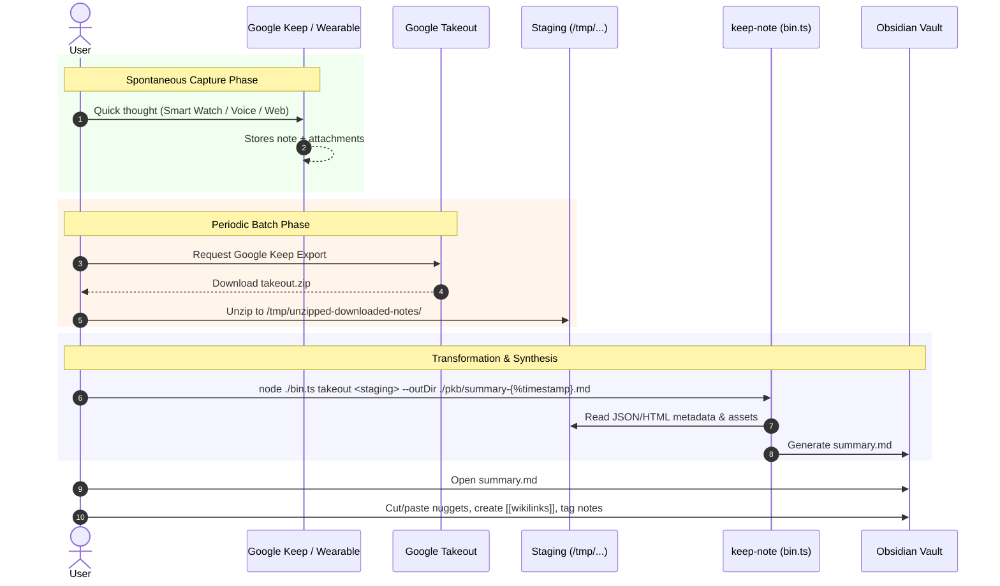

# keep-note

Facilitate the capture of fleeting thoughts for your personal knowledge base.



```bash
./bin.ts takeout /mnt/e/example/Takeout/Keep -o $ONEDRIVE/Documents/PKM
```

The command will create a `summary.md` document in the `-o` folder specified. The summary will contain horizontal-rule-delimited sections for each unarchived `note`. Each section will contain clipboard-friendly snippets of the note including a shell script to copy any attachments.

Consider archiving all the Notes taken out so they don't ge taken out again.

Organize the note sections into proper settlement in the knowledge base destination.

[Export your data from Google Keep - Google Keep Help](https://support.google.com/keep/answer/10017039?visit_id=639106789686862238-1248912857&p=keep_takeout&rd=1)

[How to download your Google data - Google Account Help](https://support.google.com/accounts/answer/3024190)

[Send a Keep note to another app - Computer - Google Keep Help](https://support.google.com/keep/answer/6320648?hl=en&ref_topic=6262828)
