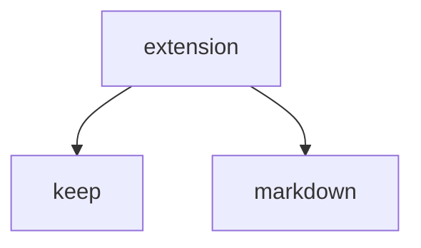

# Libs

[GitHub Flavored Markdown Spec](https://github.github.com/gfm/)

[What markdown standard is Obsidian using? - Help - Obsidian Forum](https://forum.obsidian.md/t/what-markdown-standard-is-obsidian-using/85793)
